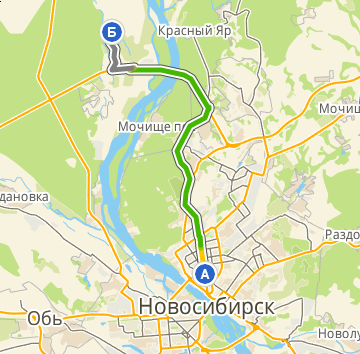

### Расположение.
Дачный посёлок СНТ «Лира» расположен на территории Колыванского района Новосибирской области, 2500м севернее автотрассы Новосибирск-Омск. Благодаря удачному транспортному расположению расстояние до общества для жителей правого берега составляет 26км от площади Калинина по Северному объезду, для жителей левого берега - 35км от площади Энергетиков по Колыванскому шоссе.

### Уникальность.
Общество уникально своим размещением среди трёх лесных озер, благодаря чему большинство участков имеет собственный выход к озеру, а значит возможность обустройства собственного пляжа или купальни, места для рыбалки, кроме того участки всегда обеспечены бесплатной водой для полива. Уникальность состоит ещё и в том, что, в отличие от соседних обществ, расположенных на открытой местности, общество «Лира» располагается в берёзовом лесу, что гарантирует вам  многоголосое пение птиц и прохладу в знойный день.
Несмотря на небольшую удалённость от города и транспортную доступность, благодаря лесной тишине и спойствию водной глади, после городской суеты на пару выходных можно почувствовать себя в совершенно другом мире, а при желании в нём можно жить постоянно.
К сожалению не все свободные в настоящее время участки имеют указанные преимущества, количество их ограничено, однако, для любителей солнца и огородничества в обществе имеются участки открытые, с выходом к озеру и без такового. Список свободных участков и продаваемых членами общества, их расположение и размер взноса можете посмотреть в разделе «Участки».

### Электроснабжение.
Технические условия на технологическое присоединение к электрическим сетям получены в 2014 году.
Проект электроснабжения разработан и согласован в 2015 году.
Строительство линии электроснабжения будет осуществлятся в 2016 году.

### Документы.
Земельный участок из категории земель сельхозназначения площадью 6689300кв.м. (661га) с 2014 года находится в собственности СНТ «Лира», свидетельство о собственности №54-54-26/010/2014-941. Разработан и утверждён генеральный план общества на 121 участок. При желании, с соблюдением законодательства, член общества может оформить право собственности на предоставленный ему земельный участок.

#####[Устав СНТ "Лира"](../doc/Устав СНТ Лира.doc)
#####[Реквизиты СНТ "Лира"](../doc/Реквизиты СНТ Лира.jpg)
#####[ДОКУМЕНТЫ И ПИСЬМА О ПРИСОЕДИНЕНИИ К ЭЛ. СЕТЯМ](../doc/ДОКУМЕНТЫ И ПИСЬМА О ПРИСОЕДИНЕНИИ К ЭЛ. СЕТЯМ.rar)
#####[Список представителей](../doc/Список представителей.docx)
#####[Собрание уполномоченных 2015г](../doc/Собрание уполномоченных 2015г.doc)
